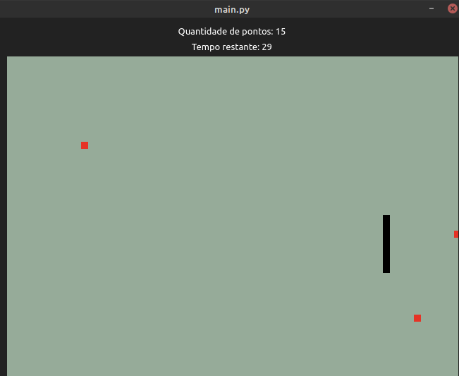

# COBRAZONA GL ++ 

Jogo da cobra mais desafiador com OpenGL

# Libs utilizadas:

PyOpenGL

PySide -> binding pro Qt

# Como instalar:

**Ativar ambiente virtual:**

~$ virtual env .

~$ source bin/activate

**Instalar as dependencias:**

~$ pip install -r requirements.txt

# Como rodar:

~$ python main.py

# Como jogar:

'w' -> move para cima

'a' -> move para direita

's' -> move para baixo

'd' -> move para a direita

# Objetivo do jogo:

Coletar pontos que vão aparecer aleatoriamente na tela, tomando cuidado com o tempo que está diminuindo.

Quando o tempo acabar, você perde.

Se você colidir com você mesmo, você perde.

Se você colidir com a parede, você perde.
